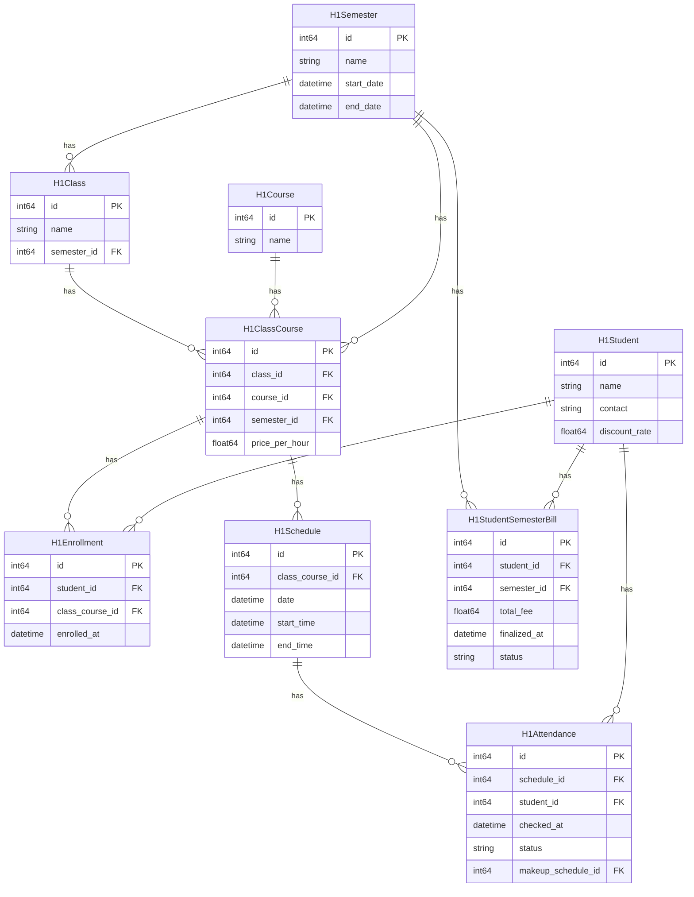

```mermaid
erDiagram
    H1Student {
        int64 id PK
        string name
        string contact
        float64 discount_rate
    }

    H1Semester {
        int64 id PK
        string name
        datetime start_date
        datetime end_date
    }

    H1Course {
        int64 id PK
        string name
    }

    H1Class {
        int64 id PK
        string name
        int64 semester_id FK
    }

    H1ClassCourse {
        int64 id PK
        int64 class_id FK
        int64 course_id FK
        int64 semester_id FK
        float64 price_per_hour
    }

    H1Enrollment {
        int64 id PK
        int64 student_id FK
        int64 class_course_id FK
        datetime enrolled_at
    }

    H1Schedule {
        int64 id PK
        int64 class_course_id FK
        datetime date
        datetime start_time
        datetime end_time
    }

    H1Attendance {
        int64 id PK
        int64 schedule_id FK
        int64 student_id FK
        datetime checked_at
        string status
        int64 makeup_schedule_id FK
    }

    H1StudentSemesterBill {
        int64 id PK
        int64 student_id FK
        int64 semester_id FK
        float64 total_fee
        datetime finalized_at
        string status
    }

    H1Student ||--o{ H1Enrollment : "has"
    H1Student ||--o{ H1Attendance : "has"
    H1Student ||--o{ H1StudentSemesterBill : "has"

    H1Semester ||--o{ H1Class : "has"
    H1Semester ||--o{ H1ClassCourse : "has"
    H1Semester ||--o{ H1StudentSemesterBill : "has"

    H1Course ||--o{ H1ClassCourse : "has"

    H1Class ||--o{ H1ClassCourse : "has"

    H1ClassCourse ||--o{ H1Enrollment : "has"
    H1ClassCourse ||--o{ H1Schedule : "has"

    H1Schedule ||--o{ H1Attendance : "has"

```